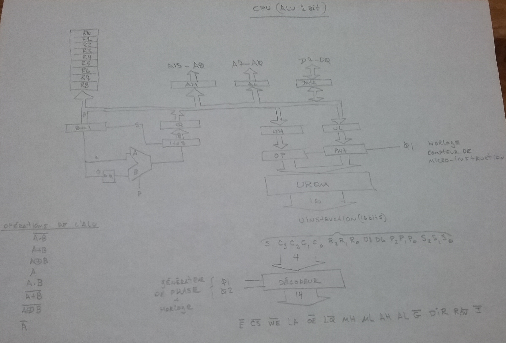
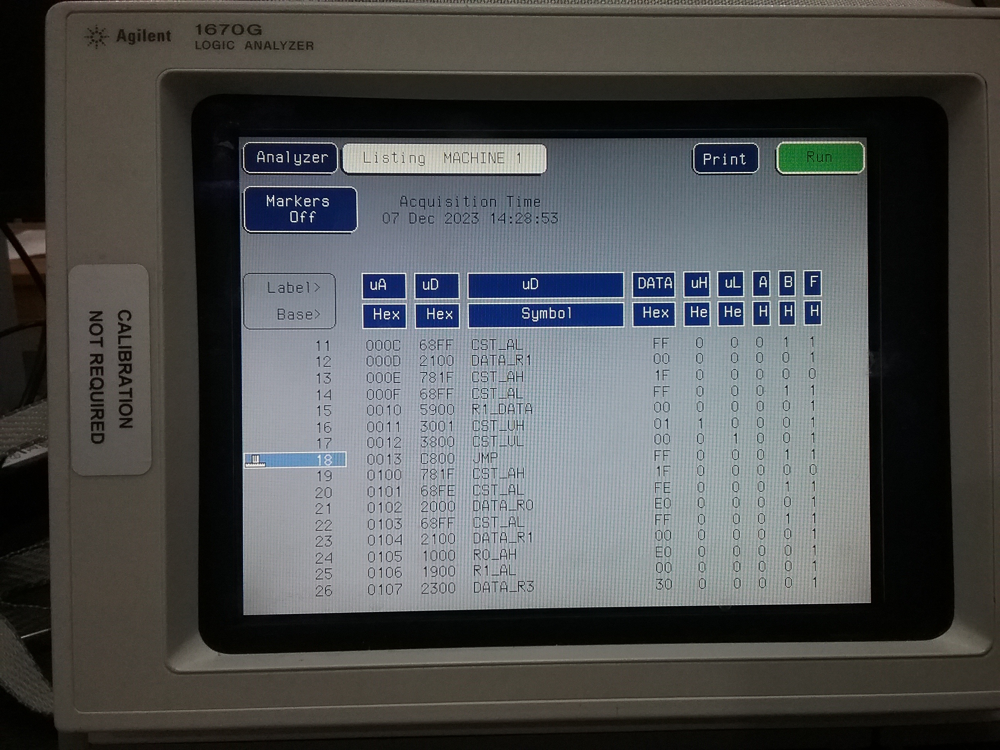

I build this CPU using 74LS circuit with some EEPROM. My goal was to try to make my own cpu using only a one bit ALU. I already know from the start that the machine would be quite slow compare to existing standard but at least i can see if i can make it work.  All the microcode to control the machine is stored in 2 binary file to be programmed into 2864. A micro assembler program was developed to help generate the micro instructions. Some external RAM is required to support the microcode. Here is the address mapping or important registers ressources:

* 0000H - 17FFH Total RAM space
* 0000H - 00FFH Stack
 0100H - 17EF  Free for application
 17F0H SP		Stack Pointer 8 bit
 17F1H temp SP1
 17F2H temp	SP2
 17FAH bit<0>	Equal
 17FBH bit<0>	Carry
 17FCH A		Register
 17FEH IPH		Instruction Pointer MSB
 17FFH IPL		Instruction Pointer LSB

Bloc Diagram of the architecture

Picure of the final build connected to the Logic Analyzer

Single step debug session from the start became too painfull so i connected a logic analyzer to get better history on program exection. Using symbol assignment it is possible to do some micro code dissassembly.

I started documenting this project when i saw all the other wonderfull machines documented in this link: Homebuilt CPUs WebRing
Definitely check out other awesome homebrew CPU builds on Warren's https://www.homebrewcpuring.org

Join the ring?
To join the Homebuilt CPUs ring, drop Warren a line (mail is obfuscated, you have to change [at] to @), mentioning your page's URL. He'll then add it to the list. You will need to copy this code fragment into your page (or reference it.)
Note: The ring is chartered for projects that include a home-built CPU. It can emulate a commercial part, that′s OK. But actually using that commercial CPU doesn′t rate. Likewise, the project must have been at least partially built: pure paper designs don′t rate either. It can be built using any technology you like, from relays to FPGAs.
