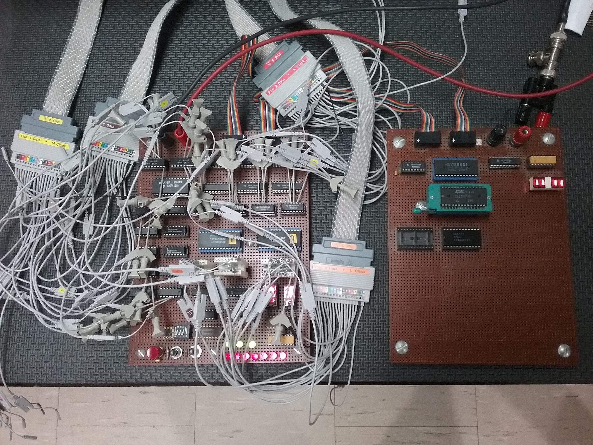
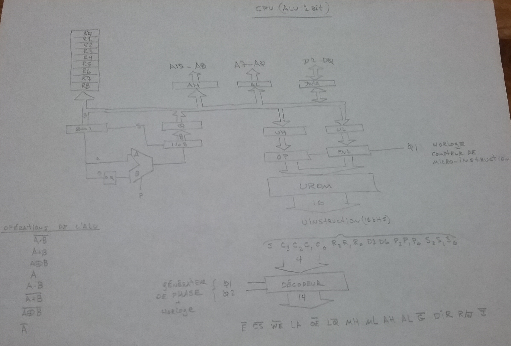
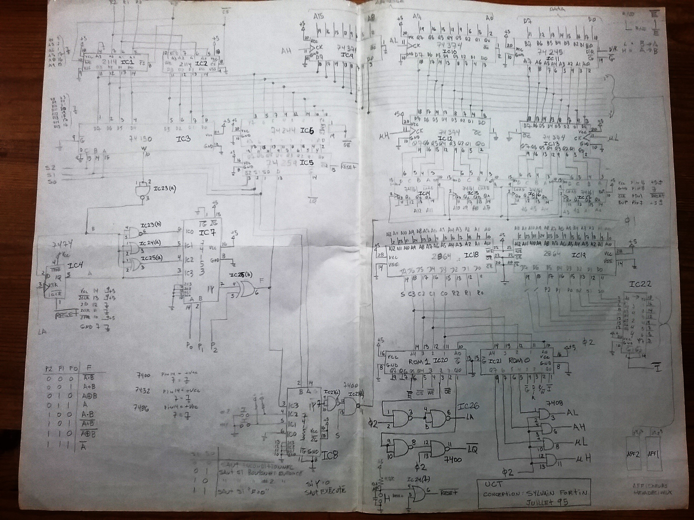
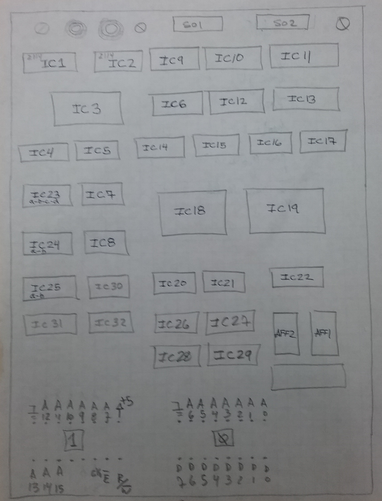
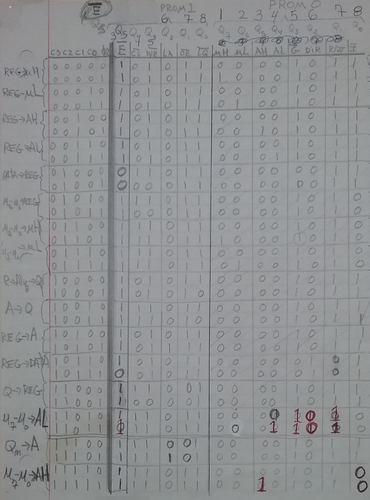
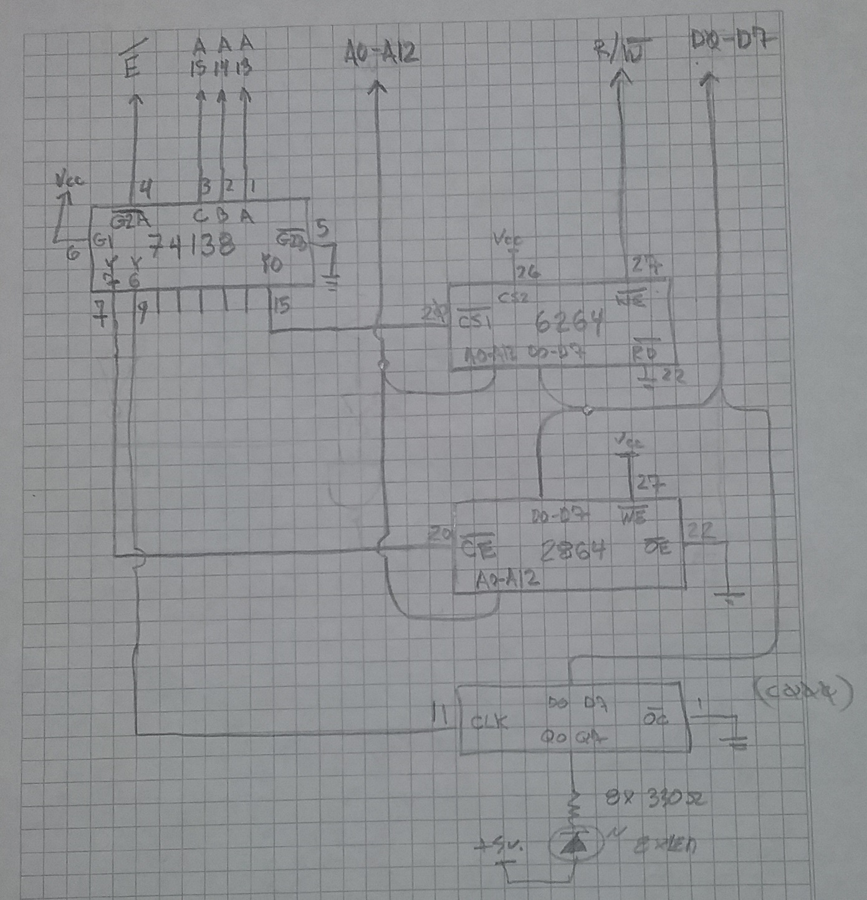
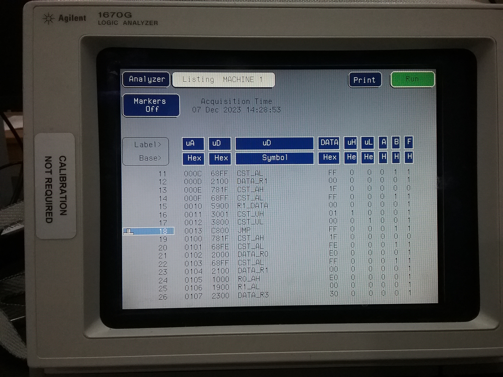

I built this CPU at home using 74LS circuit with some EEPROM.

 My goal was to try making my own CPU using only a one-bit ALU. I knew from the start that the machine would be quite slow compared to existing standards, but at least i can see if i can make it work.  All the microcode to control the machine is stored in 2 binary files to be programmed into 2864 EEPROM. A micro assembler program was developed to help generate the micro instructions. Some external RAM is required to support the microcode. Here is the RAM address mapping to implement the storage needed:

0000H - 17FFH Total RAM space
-----------------------------
* 0000H - 00FFH  Stack
* 0100H - 1FEF   Free for application
* 1FF0H SP		  Stack Pointer 8 bit
* 1FF1H temp SP1
* 1FF2H temp SP2
* 1FFAH bit<0>	  Equal Status
* 1FFBH bit<0>	  Carry Status
* 1FFCH A		  A Register
* 1FFEH IPH		  Instruction Pointer MSB
* 1FFFH IPL		  Instruction Pointer LSB

Register A, Stack Pointer, Status flag and Instruction Pointer are stored in RAM. This is purely to save on chip count at the expense of a slower machine.

Here is the top level diagram of this relatively simple architecture.

The hand written schematic

The cpu board layout view

The ROM decoding table encodes the different combinations of how data can travel between the components. This ROM expands the number of lines we can control with the EEPROM microcode, saving the number of bits required. This architecture works using 16-bits micro-instructions. The chips IC20 and IC21 are 74S188 256 Open Collector PROMs (really one-time programmable). Several chips were lost before finding the correct table values.

The io board schematic. A RAM, EEPROM to store the application program with some LEDs.

Single clock step debug sessions starting from reset, using only a couple of LEDs to inspect ucode address and main bus byte display, became too painfull. I finally purchased a reasonably priced Agilent 1670G Logic Analyzer on eBay and connected it to MyCpu to obtain a better history of program exection, easing the debugging process. Using symbol assignment, it is possible to perform some rudimentary microcode dissassembly.
Picure of the final wire wrap assembly connected to the Logic Analyzer

A view on the analyzer showing some microcode dissassembly.

I began documenting this project when i encountered other wonderfull machines showcased in this link: Homebuilt CPUs WebRing
Definitely check out other awesome homebrew CPU builds on Warren's https://www.homebrewcpuring.org

Interested in joining the ring?
To join the Homebuilt CPUs ring, drop Warren a line (mail is obfuscated, you have to change [at] to @), mentioning your page's URL. He'll then add it to the list. You will need to copy this code fragment into your page (or reference it.)
Note: The ring is chartered for projects that include a home-built CPU. It can emulate a commercial part, that′s OK. But actually using that commercial CPU doesn′t rate. Likewise, the project must have been at least partially built: pure paper designs don′t rate either. It can be built using any technology you like, from relays to FPGAs.
