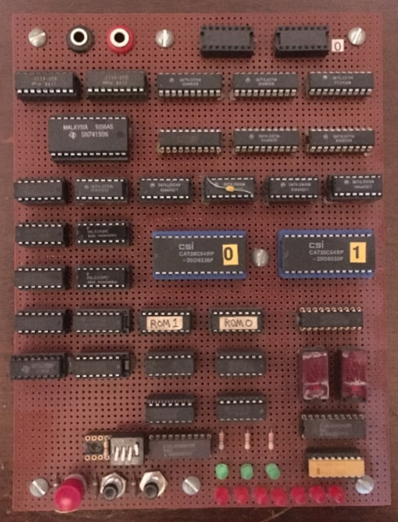

# Homebrew CPU Project

I built this CPU at home using 74LS logic ICs, EEPROMs, RAMs and GALs, driven by curiosity and a desire to understand processor design at a fundamental level.

---

## 🔧 Project Overview
My goal was to create a **fully functional CPU** using a **1-bit ALU**. While this results in relatively slow execution speeds, it allows me to explore the control and datapath mechanisms in detail.

- All **microcode** for the CPU is stored in **two binary files** programmed into 2864 EEPROM chips.
- A custom **microassembler** generates these micro-instructions.

---

## 🧠 Custom CPU PCB Update

With the core architecture proven on the wire-wrap prototypes, the custom PCB version of the CPU is now complete. This phase of the project has been generously sponsored by PCBWay.

A special thank you to Liam from the Marketing Department at PCBWay, who discovered the wire-wrap prototype on GitHub and kindly offered sponsorship to support the development of a fully professional PCB.

🛠️ PCBWay Manufacturing Review
I’m happy to share my experience working with PCBWay for manufacturing the custom PCB version of my CPU project. Here's a quick summary of how it went:

First, I transferred the handwritten schematic into KiCad, then completed the routing for each required part. I was able to find all the necessary components on AliExpress. After carefully checking my Gerber files, it was time to send the design to the factory.

🔁 I was genuinely impressed by PCBWay’s one-click KiCad integration — all design files were submitted automatically to the PCBWay factory with a single click. No file packaging, no ZIP uploads — just click and go! The ordering process was fast and seamless.

🌐 The web interface was intuitive and transparent, allowing me to track each step of the production process in real time.

📦 The PCBs arrived astonishingly quickly, properly boxed and well-protected with excellent packaging.

🛒 Although I ordered 5 PCBs, they kindly included 6 boards in the shipment — a thoughtful bonus!

🌍 There’s a strong online community around PCBWay, full of shared open-source hardware projects — very inspiring!

## 🧠 Board design files
[Download Schematic PDF](Kicad/MyCPU_Schematic.pdf)

## 🗂 Microcode and Assembler

💾 [Download Microcode Source](uCodeAssembler/urom.lst)  
💾 [Download Microcode Assembler](uCodeAssembler/UctMicroAssembler/Program.cs)  
💾 [Download Opcode Assembler](opCodeAssembler/Program.cs)  
💾 [Download Diagnostic Program](opCodeAssembler/examples/diag.asm)  

## 🧠 Register Implementation on RAM

The design uses address-mapped RAM to support the CPU’s operation. This approach saves chip count, though at the cost of execution speed.

The following registers are implemented in RAM:
- Instruction Pointer
- Register A
- Carry Flag
- Equal Flag
- Index Register
- Stack Pointer
- The Stack

Here is the memory address map:

0000H - 17FFH Total RAM space
-----------------------------
* 0000H - 17FFH Total RAM space
* 0000H - 00FFH Stack
* 0100H - 17EF  Free for application
* 1FF0H SP      Stack Pointer 8 bit
* 1FF1H JSH     Temporary storage for JSR MSB address
* 1FF2H JSL          "       "     "   "  LSB    "
* 1FF3H XH      Index Register MSB
* 1FF4H XL      Index Register LSB
* 1FFAH E       bit<0> Equal Status bit
* 1FFBH C       bit<0> Carry Status bit
* 1FFCH A       Register
* 1FFEH IPH	    Instruction Pointer MSB
* 1FFFH IPL     Instruction Pointer MSB
* C000H         LED port
* E000H - F000H EEPROM for application program

---

## System Overview

### Top-Level Architecture Diagram  

### Hand-Written CPU Schematic  

### CPU Board Layout View  

---

## Microcode and Control ROMs

The ROM decoding table encodes how data moves between components.  
This reduces the number of control bits required by expanding microcode control using external PROMs.

- ROM chips: **IC20** and **IC21** (74S188, 256×1 Open Collector PROMs)
- These are *one-time programmable* PROMs.
- Several chips were sacrificed before the correct decoding table was finalized.

---

## I/O Board Schematic

Includes:
- RAM
- EEPROM (for application program)
- LEDs for visual feedback

---

## Debugging Setup

Early debugging involved **single clock stepping** and LEDs to display microcode address and main bus data.  
This was quickly found to be too tedious, leading to the acquisition of an **Agilent 1670G Logic Analyzer** (eBay bargain!).

- Logic analyzer connected to **MyCpu**
- Allows recording of instruction traces
- Symbol assignment enables **rudimentary microcode disassembly**

### Final Wire-Wrap Assembly with Logic Analyzer  

### Microcode View on Logic Analyzer  

---

## 🧵 Wire-Wrap Prototype

Before moving to a PCB, I built a **wire-wrap prototype** to test the design on real hardware. This stage was essential for debugging the microcode, verifying timing, and refining the instruction set.

Wire-wrapping made it easier to make changes during development while still providing a reliable and compact way to interconnect components.

---

## Inspiration and Community

I began documenting this project after discovering **other wonderful homebrew machines** featured on:

👉 [Homebuilt CPUs WebRing](https://www.homebrewcpuring.org)

### Join the Ring!

Interested in joining the Homebuilt CPUs WebRing?

- Contact **Warren** (email address is obfuscated—replace `[at]` with `@`)
- Mention your page URL and request to join
- Add the WebRing code fragment to your site

📌 **Note:** The ring is for *actual home-built CPUs*. Emulations of commercial parts are OK.  
However, projects must be *partially or fully built*—**paper designs don’t qualify**.  
Technologies used can include **relays**, **TTL**, **CMOS**, **FPGAs**, etc.