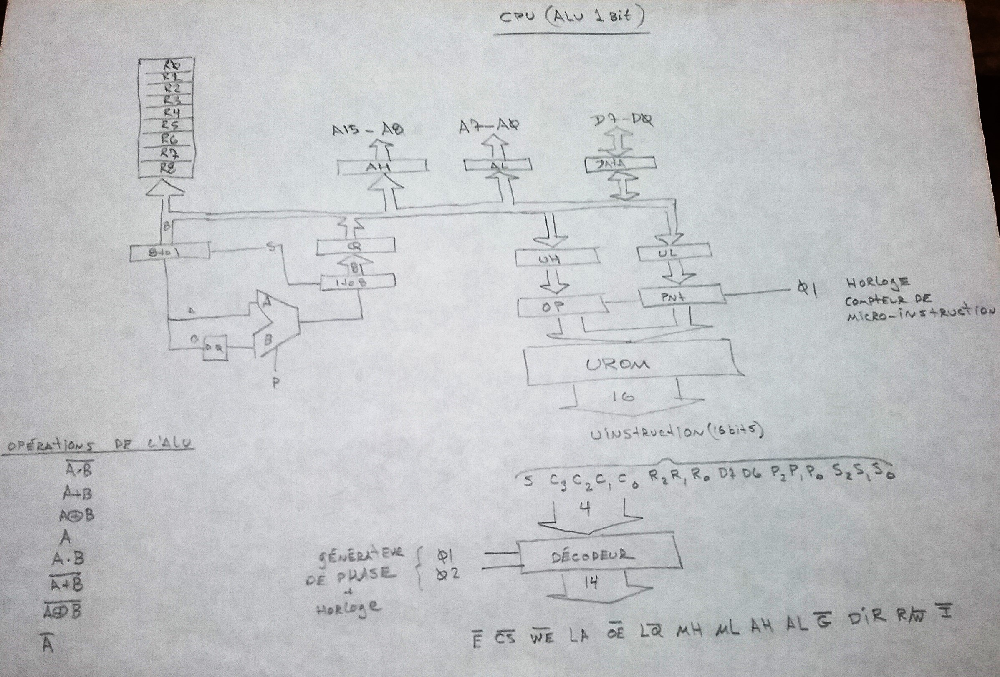

# Homebrew CPU Project

I built this CPU at home using 74LS logic ICs, EEPROMs, RAMs and GALs, driven by curiosity and a desire to understand processor design at a fundamental level.

---

## 🔧 Project Overview
My goal was to create a **fully functional CPU** using a **1-bit ALU**. While this results in relatively slow execution speeds, it allows me to explore the control and datapath mechanisms in detail.

- All **microcode** for the CPU is stored in **two binary files** programmed into 2864 EEPROM chips.
- A custom **microassembler** generates these micro-instructions.

---

## 🧠 Custom CPU PCB Update

After validating the core architecture on a wire-wrap prototype, the custom PCB version of the CPU is now complete. The boards were professionally fabricated by PCBWay, thanks to a generous sponsorship offered by Liam from their marketing team, who discovered the project on GitHub. This support helped transition the design from a hand-built prototype to a professionally produced PCB.

## 🛠️ PCBWay Manufacturing Review

I’m happy to share my experience working with PCBWay for manufacturing the custom PCB version of my CPU project. Here's a quick summary of how it went:

First, I transferred the handwritten schematic into KiCad, then completed the routing for each required part. I was able to find all the necessary components on AliExpress. After carefully checking my Gerber files, it was time to send the design to the factory.

🔁 I was genuinely impressed by PCBWay’s one-click KiCad integration — all design files were submitted automatically to the PCBWay factory with a single click. No file packaging, no ZIP uploads — just click and go! The ordering process was fast and seamless.

🌐 The web interface was intuitive and transparent, allowing me to track each step of the production process in real time.

📦 The PCBs arrived astonishingly quickly, properly boxed and well-protected with excellent packaging. Although I ordered 5 boards, PCBWay generously included 6 — a thoughtful bonus!

The soldering process went smoothly. I used footprints optimized for hand soldering, with larger pads to make it easier to work with. Only a couple of 0603 surface-mount resistors are present on the board.

🔌 First power-on: the board worked on the first try!
I reused the same microcode and program EEPROM, along with the GAL, that were previously tested on the wire-wrap prototype — total success.

Since the new board has a solid ground plane, I expect it will run faster than the prototype, with improved signal integrity. I plan to validate this with an oscilloscope soon — stay tuned for updates!

🌍 There’s a strong online community around PCBWay, full of shared open-source hardware projects — very inspiring!

## 🧠 Board design files
[Download Schematic PDF](Kicad/MyCPU_Schematic.pdf)

## 🧵 Wire-Wrap Prototype

Before moving to a PCB, I built a **wire-wrap prototype** to test the design on real hardware. This stage was essential for debugging the microcode, verifying timing, and refining the instruction set.

Wire-wrapping made it easier to make changes during development while still providing a reliable and compact way to interconnect components.

---

## 🗂 Microcode and Assembler

💾 [Download Microcode Source](uCodeAssembler/urom.lst)  
💾 [Download Microcode Assembler](uCodeAssembler/UctMicroAssembler/Program.cs)  
💾 [Download Opcode Assembler](opCodeAssembler/Program.cs)  
💾 [Download Diagnostic Program](opCodeAssembler/examples/diag.asm)  

---

## 🧠 Register Implementation on RAM

The design uses address-mapped RAM to support the CPU’s operation. This approach saves chip count, though at the cost of execution speed.

The following registers are implemented in RAM:
- Instruction Pointer
- Register A
- Carry Flag
- Equal Flag
- Index Register
- Stack Pointer
- The Stack

Here is the memory address map:

0000H - 17FFH Total RAM space
-----------------------------
* 0000H - 17FFH Total RAM space
* 0000H - 00FFH Stack
* 0100H - 17EF  Free for application
* 1FF0H SP      Stack Pointer 8 bit
* 1FF1H JSH     Temporary storage for JSR MSB address
* 1FF2H JSL          "       "     "   "  LSB    "
* 1FF3H XH      Index Register MSB
* 1FF4H XL      Index Register LSB
* 1FFAH E       bit<0> Equal Status bit
* 1FFBH C       bit<0> Carry Status bit
* 1FFCH A       Register
* 1FFEH IPH	    Instruction Pointer MSB
* 1FFFH IPL     Instruction Pointer MSB
* C000H         LED port
* E000H - F000H EEPROM for application program

---

## System Overview

### Top-Level Architecture Diagram  

### Hand-Written CPU Schematic  
When I started this project back in 1995, I didn’t have access to schematic capture software or a decent computer that could run it. I only had an IBM Personal Computer XT, so I used pen and paper to sketch how the electronic components were connected.

### CPU Board Layout View  

---

## Microcode and Control ROMs

The microcode is stored in two 2864 EEPROM ICs.
Originally, a BASIC program was used to translate a text file of micro-instructions into a .hex file.
A homemade EEPROM programmer was built to write these files via the parallel port of an IBM PC XT.

Today, a modern C# program performs the same translation into .hex format for programming.

The ROM decoding table encodes how data moves between components. This reduces the number of control bits required by expanding microcode control using external PROMs.

- ROM chips: **IC20** and **IC21** (74S188, 256×1 Open Collector PROMs)
- These are *one-time programmable* PROMs.
- Several chips were sacrificed before the correct decoding table was finalized.

In the PCB version of the board, two GAL16V8 replaces the PROMs to implement the decoding table, offering greater flexibility and eliminating the need for one-time programmable chips.

---

## I/O Board Schematic
Wire wrap proto required a second board to include the following:
- RAM
- EEPROM (for application program)
- LEDs for visual feedback

The PCB version include all these in the sameboard.

The PCB version includes all of these components on a single board.
---

## Debugging Setup

Initially, I was single-stepping using push switches, LEDs, and a pair of classic TIL311 hex displays to monitor the 8-bit data bus on the wire-wrap prototype, but it quickly stopped being fun. When bugs like stack corruption became too tricky to debug, I decided to get an Agilent 1670G Logic Analyzer. I found one on eBay for 510 CAD, which seemed like a reasonable price—I never thought I’d own one! It’s the color LCD version, so now I get to see the word in color.

With the analyzer, I can trigger on specific conditions and even do some reverse assembly of the microcode using basic symbolic decoding. It allow recording of detailed intructions traces. Quite cool!

### Final Wire-Wrap Assembly with Logic Analyzer  
Here the Logic analyzer connected to **MyCpu** for a debug session.

### Microcode View on Logic Analyzer  

---

## Inspiration and Community

I began documenting this project after discovering **other wonderful homebrew machines** featured on:

👉 [Homebuilt CPUs WebRing](https://www.homebrewcpuring.org)

### Join the Ring!

Interested in joining the Homebuilt CPUs WebRing?

- Contact **Warren** (email address is obfuscated—replace `[at]` with `@`)
- Mention your page URL and request to join
- Add the WebRing code fragment to your site

📌 **Note:** The ring is for *actual home-built CPUs*. Emulations of commercial parts are OK.  
However, projects must be *partially or fully built*—**paper designs don’t qualify**.  
Technologies used can include **relays**, **TTL**, **CMOS**, **FPGAs**, etc.